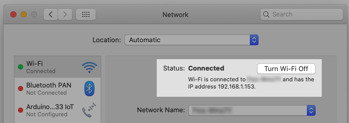
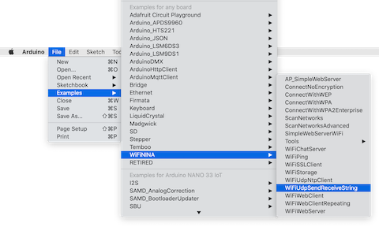

# Sending Arduino Values to TouchDesigner via UDP over WiFi

The following write up will show how to combine sample code from various sources to send multiple IMU sensor values from the [Arduino Nano 33 IoT](https://store-usa.arduino.cc/products/arduino-nano-33-iot) to be read and interpreted in [TouchDesigner](https://derivative.ca/)

## Materials and Libraries
* [Arduino Nano 33 IoT](https://store-usa.arduino.cc/products/arduino-nano-33-iot) (or other Wifi Enabled board, MKR 1010, etc)
* [WifiNINA Library](https://www.arduino.cc/en/Reference/WiFiNINA)
* [OSC Library](https://www.arduino.cc/reference/en/libraries/osc/) (not necessary for UDP communication)
* WiFi access
    * NOTE: If you are working at ITP / IMA:
        * the `nyu` WiFi network will **NOT** work
        * Ask your professor or ER manager for sandbox access
    * If you are testing at home or from a hotspot your standard wep/wpa2 network and password access should work fine.
* [TouchDesigner](https://derivative.ca/)

## Setting up Arduino
### Check your network and computer IP
Your arduino will have to be on the same Wifi network as the computer running TouchDesigner.  Make sure your computer is connected to the Wifi network you wish to use for the project. Have your wifi name and password, and IP of your computer handy.  Follow steps below if you don't have that information

**NOTE:** If you are at ITP / IMA you must [register your device with nyu](https://computer.registration.nyu.edu/) and you must reach out to your professor or ER Manager to gain sandbox access. You will also need your Arduino's MAC Address, which can be found by running the `ScanNetworks` example.  Go to __File -> Examples -> WifiNINA -> ScanNetworks__. Open the Serial Monitor and this sketch will print the MAC address of your Arduino before scanning for available networks.

If you are on a Mac find your IP by first connecting to your desired network and navigating to `System Preferences` -> `Network` .  IP may be set to dynamic by default so it might change if you are switching networks (eg working from home vs school vs hotspot etc).  



### Edit the Arduino UDP Example Sketch
Open the arduino IDE and Navigate to the WifiUDPSendReceiveString Example.

__File -> Examples -> WifiNINA -> WifiUDPSendReceiveString__



### Use your IP and Network Credentials in the Sketch

This arduino example uses a separate header file to store your wifi access credentials. Look at the tab called `arduino_secrets.h` and enter your credentials in the quotes. `SECRET_SSID` is your network SSID (name), `SECRET_PASS` is your network password


In the main example sketch make sure your libraries and `arduino_secrets.h` file is included as such:

```
#include <SPI.h>
#include <WiFiNINA.h>
#include <WiFiUdp.h>

#include "arduino_secrets.h" 
///////please enter your sensitive data in the Secret tab/arduino_secrets.h
char ssid[] = SECRET_SSID;        // your network SSID (name)
char pass[] = SECRET_PASS;    // your network password (use for WPA, or use as key for WEP)
```

Optional: Make variables for your outgoing ip address the ports over which you'll want to listen and send.

```
unsigned int localPort = 2390;      // local port to listen on
unsigned int sendPort = 7403;      // local port to send on
char outIP[] = "TD.COMPUTER.IP.HERE "; // insert your own computer's IP Address
```

Next create an instance of the UDP object, and inside of `setup()` begin your wifi and UDP protocol.

```
WiFiUDP Udp;
```
Each sensor value will be send out as a char array. Lets make 2 for our 2 sensors

```
char out [4];
char out2 [4];
```

```

void setup() {
  //Initialize serial and wait for port to open:
  Serial.begin(9600);
  while (!Serial) {
    ; // wait for serial port to connect. Needed for native USB port only
  }

  // check for the WiFi module:
  if (WiFi.status() == WL_NO_MODULE) {
    Serial.println("Communication with WiFi module failed!");
    // don't continue
    while (true);
  }

  String fv = WiFi.firmwareVersion();
  if (fv < WIFI_FIRMWARE_LATEST_VERSION) {
    Serial.println("Please upgrade the firmware");
  }

  // attempt to connect to WiFi network:
  while (status != WL_CONNECTED) {
    Serial.print("Attempting to connect to SSID: ");
    Serial.println(ssid);
    // Connect to WPA/WPA2 network. Change this line if using open or WEP network:
    status = WiFi.begin(ssid, pass);

    // wait 10 seconds for connection:
    delay(10000);
  }
  Serial.println("Connected to WiFi");
  printWifiStatus(); // function defined at end of sketch

  Serial.println("\nStarting connection to server...");
  // if you get a connection, report back via serial:
  Udp.begin(localPort);
}
```
Note: This line of code `while (!Serial)` will halt the rest of the program until you open the serial monitor or another serial connection.  For demo or production you may want to comment this line out.

Lastly, read your sensors, convert the sensor data from int to char[] and send it out via UDP. For UDP you must begin your transmission with `beginPacket(OUTGOING IP, OUTGOING PORT)` send data with the `wrtie()` function, and end transmission with `endPacket()`

```
void loop() {
    int sensor1 = analogRead(A0); // sensor 1 data
    int sensor2 = analogRead(A1); // sensor 2 data
  
    String out = String(sensor1); // convert to String
    String out2 = String(sensor2); // convert to String
    
    char outgoing[]={0,0,0,0}; // create new array
    char outgoing2[]={0,0,0,0}; // create new array
    
    // transfer string data to outgoing char arrays[]
    for (int i = 0; i < sizeof(out); i++) { 
        outgoing[i] = out[i];
    }

    for (int i = 0; i < sizeof(out2); i++) {
        outgoing2[i] = out2[i];
    }
    
    // print serial for feedback
    Serial.print(sensor1);
    Serial.print("/");
    Serial.println(sensor2);

    //format and sent udp
    Udp.beginPacket(outIP, sendPort);
    Udp.write(outgoing);
    Udp.write("/");     // udp and osc messages are usually separated with "/" if sending multiple values
    Udp.write(outgoing2);
    Udp.endPacket();
    delay(200); // if you are not using call and response, do not send more information than you need
}

```

## Receiving and parsing information in TouchDesigner
In TouchDesigner use the UDP In DAT to receive UDP information

Set up the DAT so that the port is the same as your Arduino's outgoing port, and that the DAT's local address is the same one the arduino is sending to


Once you are receiving information use a Conver DAT to separate messages into individual columns.  Make sure you enter `/` in the Split Cells at field, this is what tells the DAT to separate messages using `/` as a delimiter.


Once you have separate cells for each value you can use a DATtoCHOP CHOP to convert the table into usable channel information as you see fit. Be sure to select Columns "by Index" Choose the appropriate columns (0-1 since I only have 2 values).  Under output select Channel per Column First Row is names, First Column is Values since this is how the incoming data has been formatted.


I also like to rename my channels to reflect how I might want to use them in the rest of the TD network. If the values are in order you can use `[ ]` with comma separated names to batch rename. In this case my channels will be x and y values.
![TouchDesigner network with udpin rename CHOP highlighted, showing from and to fields, from field contains asterisk, to contains [x,y]](/assets/rename.png)


## References Resources and Further Reading
* [Tom Igoe's Wifi Examples for Arduino](https://tigoe.github.io/Wifi101_examples/)
* [Elburz Sorkhabi and Matthew Ragan's Interactive & Immersive HQ](https://interactiveimmersive.io/)
* [Interactive & Immersive HQ Youtube](https://www.youtube.com/c/TheInteractiveImmersiveHQ)
* [Matthew Ragan's resources](https://matthewragan.com/teaching-resources/touchdesigner/)
* [Bileam Tschepe's youtube](https://www.youtube.com/channel/UCONptu0J1PCrW9YfBtSdqjA)
